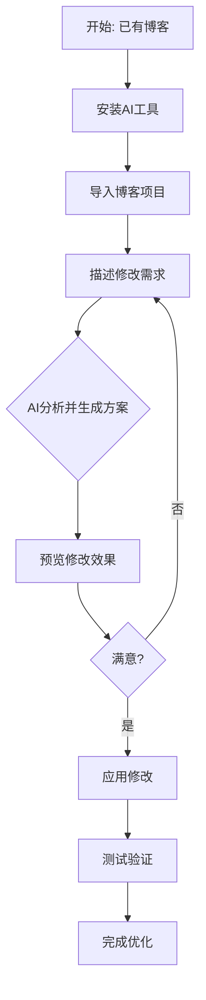

**1. 工具介绍**
- **阿里Qoder**: 一款国产AI编程助手，提供代码生成、优化和解释功能
- **字节Trae**: 字节跳动开发的AI代码工具，支持智能代码补全和重构

**2. 应用场景**
- 博客主题样式修改
- 功能模块添加/优化
- 代码错误排查
- 性能优化建议
- 响应式设计调整

**3. 优势特点**
- **零成本**: 无需服务器，无需备案
- **易上手**: 适合编程小白
- **高效**: 一键式操作，快速完成修改
- **国产化**: 使用国内开发的AI工具，访问稳定

**4. 操作流程**
  1. 安装并配置AI工具
  2. 导入博客项目
  3. 描述修改需求
  4. AI生成修改方案
  5. 预览并应用修改
  6. 测试验证效果

### **### 相关资源链接**

**UP主提供的参考博客:**
-. mmzhiku大佬: [tblog.mmzhiku.xyz](https://tblog.mmzhiku.xyz)
-. 团子和蛋糕大佬: [blog.tsh520.cn](https://blog.tsh520.cn)
-. 作者个人博客: [www.fqzlr.com](https://www.fqzlr.com)

**AI工具链接:**
-. 阿里Qoder: [qoder.com.cn](https://qoder.com.cn/referral?referral_code=7CrlUIebXESkpox5YhbUubgHrxLMW7oJ)
-. 字节Trae: [www.trae.cn/ide/download](https://www.trae.cn/ide/download)

### **### 视频所属合集**

本视频是"博客系列分享"合集的一部分，该合集包含8个视频，涵盖:
1. 博客主题对比 (Mizuki vs Firefly)
2. 域名注册教程
3. 个人博客搭建
4. Cloudflare IP优选
5. 个人图床搭建
6. Obsidian笔记联动
7. Obsidian写博客技巧
8. **本视频: AI工具修改博客**

---

## **🎨 美化版Markdown笔记**

### **### 视频概览卡片**

| 项目 | 内容 |
|------|------|
| **视频标题** | 小白怎么二改博客？使用国产codex阿里的Qoder字节的trae来一键修改 |
| **UP主** | 🍅 番茄煮理人 |
| **发布时间** | 📅 2026-06-28 |
| **视频时长** | ⏱️ 09:10 |
| **核心主题** | 🚀 使用国产AI工具快速修改个人博客 |
| **适合人群** | 👶 博客新手、编程小白 |

### **### 核心价值点**

> 💡 **核心价值**: 让不懂代码的小白也能轻松修改和优化自己的博客，通过AI工具实现"描述需求 → 自动修改"的智能化流程。

**✨ 三大优势:**
1. **零门槛** - 无需编程基础
2. **高效率** - 一键完成复杂修改
3. **国产化** - 使用国内工具，稳定可靠

### **### 工具对比表**

| 工具 | 开发商 | 主要功能 | 适用场景 |
|------|--------|----------|----------|
| **阿里Qoder** | 阿里巴巴 | 代码生成、优化、解释 | 整体重构、功能添加 |
| **字节Trae** | 字节跳动 | 智能补全、代码重构 | 细节优化、错误修复 |

### **### 操作流程图**

### **### 常见修改场景**

| 场景类型 | AI能帮您做什么 | 预期效果 |
|----------|----------------|----------|
| **样式美化** | 调整颜色、字体、布局 | 提升视觉体验 |
| **功能增强** | 添加搜索、评论、分享 | 增加互动性 |
| **性能优化** | 压缩图片、优化代码 | 加快加载速度 |
| **移动适配** | 调整响应式设计 | 手机友好体验 |
| **SEO优化** | 优化元标签、结构 | 提升搜索排名 |

### **### 资源宝库**

**📚 学习资源:**
- [ ] 观看完整"博客系列分享"合集 (8个视频)
- [ ] 参考UP主提供的三个示例博客
- [ ] 实践操作，从简单修改开始

**🔧 工具准备:**
1. **阿里Qoder** - 注册使用
2. **字节Trae** - 下载安装
3. **现有博客** - 准备修改目标

### **### 行动建议**

**🎯 新手第一步:**
1. **明确需求** - 想清楚要修改什么
2. **备份原版** - 防止修改出错
3. **小步测试** - 从简单修改开始
4. **逐步深入** - 积累经验再尝试复杂修改

**⚠️ 注意事项:**
- 修改前务必备份原始文件
- 测试修改效果后再正式应用
- 了解基本HTML/CSS概念更有帮助
- 遇到问题可参考UP主提供的示例

### **### 扩展学习**

**📈 进阶路线:**
1. **基础修改** → 使用AI工具完成简单样式调整
2. **功能添加** → 利用AI添加新功能模块
3. **性能优化** → 通过AI建议优化博客性能
4. **主题定制** → 深度定制个性化博客主题

**🔗 相关推荐:**
- 合集内其他视频 (域名注册、图床搭建等)
- Codex相关教程视频
- 个人博客搭建最佳实践

---

## **💎 总结要点**

1. **国产AI工具成熟** - 阿里Qoder和字节Trae已能胜任博客修改任务
2. **零基础友好** - 编程小白也能通过描述需求完成修改
3. **高效便捷** - 传统需要数小时的修改，现在几分钟即可完成
4. **成本极低** - 无需购买服务器，工具大多有免费额度
5. **学习曲线平缓** - 通过实践快速掌握AI辅助编程技巧

这份笔记采用了分层结构、表格对比、流程图可视化等多种Markdown美化技巧，使内容更加清晰易读。您可以根据需要进一步调整格式或添加个性化内容。